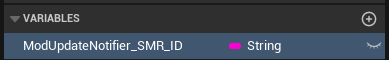
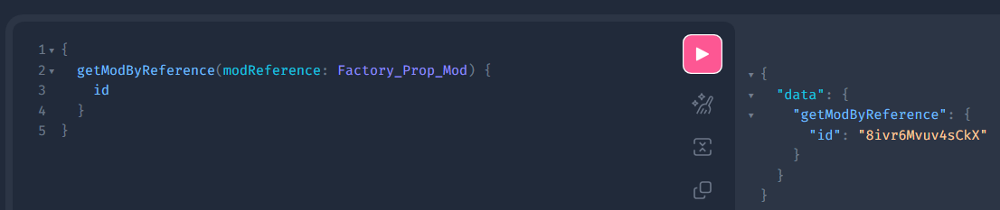
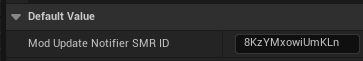
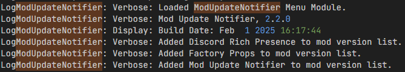
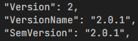
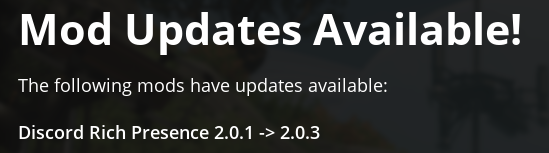
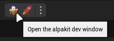
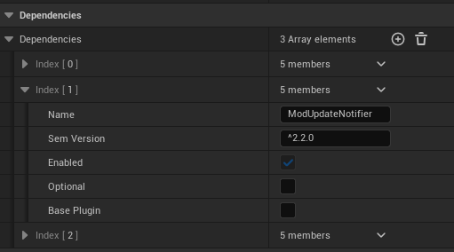
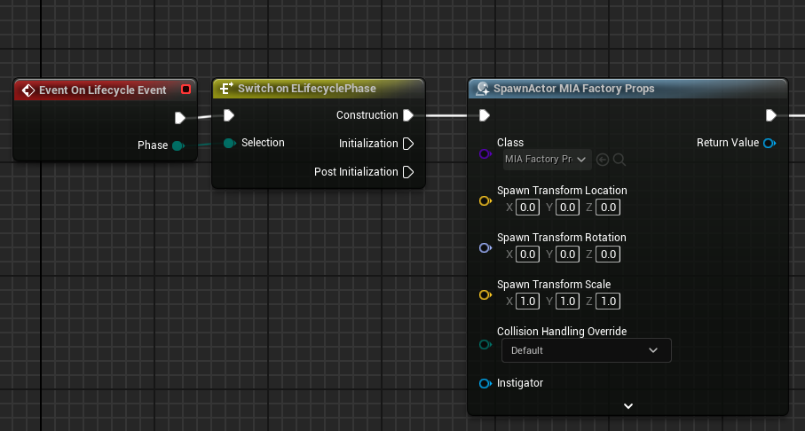
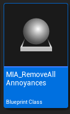

This page is intended as a guide for developers to show how to implement Mod Update Notifier into your own mods.
If you have a question about anything covered here, please ping `spacegamedev` on the Satisfactory Modding Discord server for help.

**If you are upgrading from v2.1.x of Mod Update Notifier, please read the ["Upgrade Guide: v2.1.x"](Mod-Update-Notifier.md#upgrade-guide-v2-1-x) section**

## Getting started

Implementing Mod Update Notifier is very simple.
If you haven't already, create a Blueprint Class of type `MenuWorldModule`.
Next, add a variable called `ModUpdateNotifier_SMR_ID` of type `String` and compile the Blueprint.

To get your mod's ID, go to  in your browser.
In the left panel, you'll see a bunch of commented out stuff, which you can delete.
Next, copy and paste this query command into the input field:

`
query
{
  getModByReference(modReference:Factory_Prop_Mod)
  {
    id
  }
}
`

Make sure to replace `Factory_Prop_Mod` with your mod reference.

Click the pink play button in the center to run the command.
Now you should see a result in the right panel that looks something like this:

`
{
"data": {
"getModByReference": {
"id": "8ivr6Mvuv4sCkX"
}
}
}
`

with the ID value being unique to your mod.
Copy the string from the `"id"` field and paste it into the Default Value field of your `ModUpdateNotifier_SMR_ID`.

Save and compile your work.
Your mod should now automatically be registered by Mod Update Notifier when the game starts!

## Verifying that your mod works

First, package your mod for development using Alpakit.
Then you can verify that it's working by launching the game and opening the log
located at

`%\LOCALAPPDATA%\FactoryGame\Saved\Logs\FactoryGame.log`

in a text editor such as VS Code.
Search for `ModUpdateNotifier` until you find the build info, which will list the detected mods below it like this:

If you do not see your mod in the list, go back and re-read the instructions for how to set it up.

### Version tricking

You can also trick MUN into determining your mod to be out of date, in order to test whether your mod is registered properly.
To do this, open your mod's generated `.uplugin` file located in your game install location, under

`FactoryGame\Mods\YourModName\YourModName.uplugin`

Change the `SemVersion` and `VersionName` fields of your mod to something older than the latest version on SMR.
You may also need to change the `Version` field to match the major version of the other fields.

Save the file and launch the game again.
If everything is working properly, you should see the Mod Update Notifier widget on the Main Menu showing your mod as out-of-date.

When you're done, make sure to set the uplugin fields back to their original values to avoid any potential issues.

## Optional: Automatically install MUN alongside your own mod

You can optionally have SMM automatically download and install Mod Update Notifier when your mod is installed or updated.
To do this, you will need to add MUN as a dependency for your mod in Alpakit.
**Note that this will also require MUN to be installed alongside your mod, otherwise SML won't allow the game to launch.**

Open the Unreal Editor if you haven't already, and click the Alpakit Dev button.

Next, click "Edit" on the mod for which you wish to implement Mod Update Notifier functionality.
Scroll down to the "Dependencies" section and click the plus icon to add an element.
Set the name of this element to `ModUpdateNotifier` and the "Sem Version" to `^2.2.0` or [whatever the latest version is](https://ficsit.app/mod/ModUpdateNotifier)
(Make sure to include the caret `^` at the beginning to allow newer versions of MUN as it is updated).
Leave "Optional" and "Base Plugin" unchecked.

## Get your mod listed

Once you've integrated Mod Update Notifier,
ping me (`spacegamedev`) on the Modding Discord,
so I can add your mod to the supported mods list!

## Upgrade Guide: v2.1.x

If you're upgrading from the 2.1.x version of MUN, please follow the instructions below.

Open your Menu World Module and delete the `SpawnActor` node.
You can also remove the `Event On Lifecycle Event` and `Switch on ELifecyclePhase` nodes if you're not using them for anything else.

Now you can safely delete your `MIA_YourModName` Blueprint Class, as this is no longer needed.

Continue with the ["Getting Started"](../../../assets/images/Mod-Update-Notifier.md#getting-started) section, as that will cover everything else about the upgrade process.